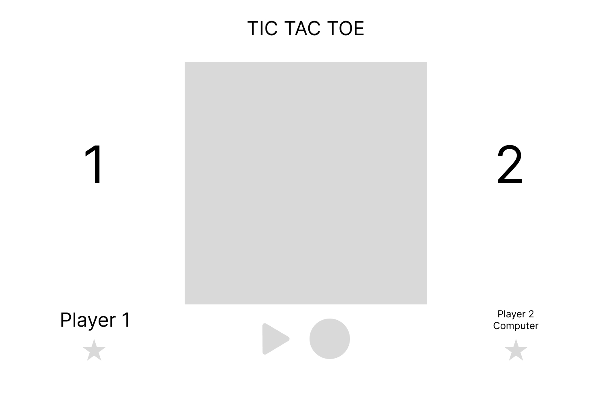
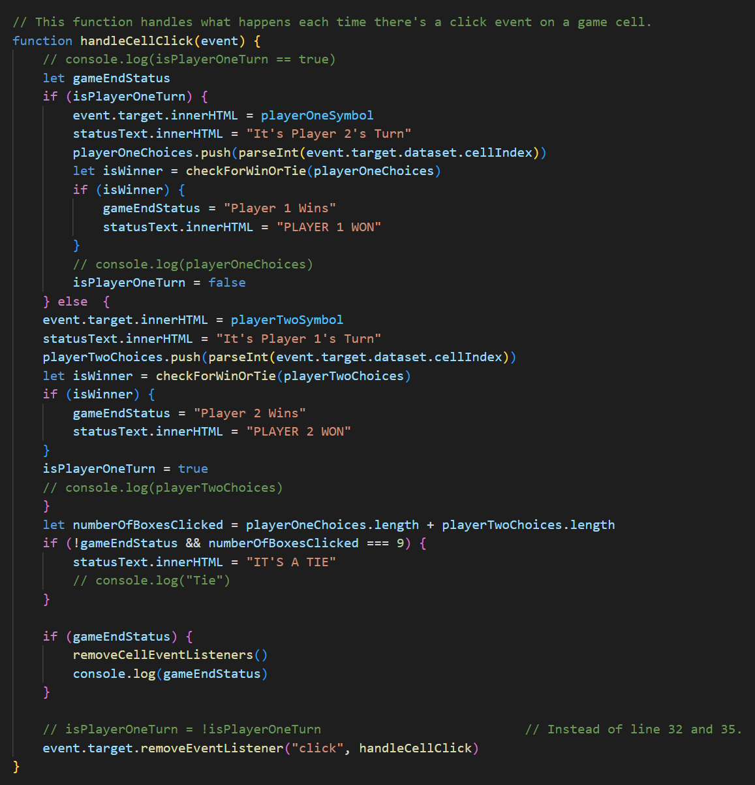

# PROJECT 1: TIC TAC TOE

## DESCRIPTION
- This is a game of tic tac toe that can be played between 2 human players.
- This game was the first of four projects as part of a Software Engineering Immersive bootcamp.
- We were assigned the project in the 3rd week having learnt some fundamental Git, HTML, CSS and JavaScript.

## DEPLOYMENT LINK
- You can access the game here: [Tic Tac Toe by Hari R](https://hpramanathan.github.io/Project1-TicTacToe/)

## GETTING STARTED/CODE INSTALLATION
- The user just needs to load the deployment link above to play the game.

## TIMEFRAME & WORKING TEAM (SOLO)
- We were given 5.5 days to work on this project on our own.

## TECHNOLOGIES USED
- CODE VERSIONING/CONTROL
  - Git and GitHub
- DEVELOPER TOOLS
  - Windows Subsystem for Linux, Visual Studio Code, Mozilla Firefox and Mozilla Firefox Developer Tools
- WIREFRAME
  - Figma

## PLANNING
- I used Figma to create a basic wireframe of the game console on the webpage.

## BUILD/CODE PROCESS
- When the page loads everything appears.
- Player 1 always goes first.
- Player 1 clicks on any square and it's filled with an X. 
- Then Player 2 clicks on any other square and it's filled with an O and they keep taking alternate turns.
- Neither player can click on a square that's already been filled in.
- If either player gets 3 of their symbols in a row (by column, row or diagonally) a winner will be declared.
- Otherwise once all the squares have been filled in, a tie will be declared.
- When you press the Restart Game button the game resets and you can play again. 

- This snippet of code is the main engine of the game.
- Each time a player clicks on a square it adds their relevant symbol (X or O). [*LINE 66* and *LINE 77*]
- It tells you whose turn it is next.
- It converts the symbol string for each player into an integer referencing the index of the relevant square on the grid.
- This then allows the function to determine if either player is a winner (the function for determining this isn't included in this snippet of code.)
- Once a result has been declared (including a tie if there's no winner)

## CHALLENGES
- I really struggled with the JavaScript coding for this project.
- I knew what I wanted the game to do but I couldn't figure out how to even get started.
- I needed prompting and elaborate discussions with my TA to make headway.

## WINS
- In the end, I'm just elated I was able to fulfil the MVP requirements by the deadline.

## KEY LEARNINGS/TAKEAWAYS
- Despite all my trials and tribulations, this was an excellent learning exercise.
- For starters, it lay bare my weak understanding of JavaScript functions which hugely hindered my ability to make headway.
- I also learnt that I need to feel a lot less embarassed about external factors (eg: how others seem to be doing) and ask for help **early**.

## BUGS
- I couldn't figure out how to get rid of the outer border on my gameboard grid.
- I couldn't also get the gameboard grid to be perfectly centred, like the rest of the text on the page.

## FUTURE IMPROVEMENTS
- As this is just the Bronze-level MVP, there is a lot I'd like to work on.
- First, I'd like to remove the bugs listed above.
- I'd like to add a score counter on either side of the gameboard.
- I'd like to add functionality so that a human can play the computer.